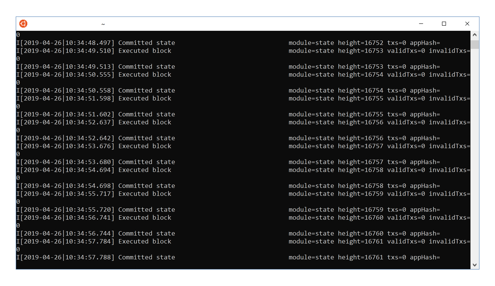

------------
Installation
------------

To run our system, we need two components:

* ``mycoind``, our custom ABCI application
* ``tendermint``, a powerful blockchain consensus engine

If you have never used tendermint before, you should
read the `ABCI Overview <https://tendermint.com/docs/introduction/introduction.html#abci-overview>`__
and ideally through to the bottom of the page. The end result
is that we have three programs communicating:

::

    +---------+                     +------------+                      +----------+
    | mycoind |  <- (local) ABCI -> | Tendermint |   <- websocket ->    | client   |
    +---------+                     +------------+                      +----------+

``mycoind`` and ``tendermint`` run on the same computer and communicate via
a binary protocol over localhost or a unix socket. Together they form
a "blockchain". In a real setup, you would have dozens (or hundreds)
of computers running this backend communicating over a self-adjusting
p2p gossip network to replicate the state. For application development
(and demos) one copy will work, but has none of the fault tolerance of a
real blockchain.

You can connect to tendermint rpc via various client libraries.
We recommend `IOV Core <iovcore.html>`__ which has very good support for
weave-based apps, as well as different blockchains (such as Ethereum and Lisk).

Install backend programs
========================

You should have a proper go development environment, as explained
in the `last section <installation.html>`__. Now, check out
the most recent version of iov-one/weave and build ``mycoind`` then get
the version 0.31.5 for ``tendermint`` from `here <https://github.com/tendermint/tendermint/releases/tag/v0.31.5>`__.
You can also build ``tendermint`` from source following the instructions
`there <https://github.com/tendermint/tendermint/blob/master/docs/introduction/install.md>`__
but make sure to use the tag **v0.31.5** as other versions might not be compatible.

**Note** we use ``go mod`` for dependency management. This is enabled by default in go 1.12+.
If you are running go 1.11.4+, you must run the following in the terminal (or add to ``~/.bashrc``):
``export GO111MODULE=on``

.. code:: console
    # cd into to your workspace that is not in your $GOPATH
    git clone https://github.com/iov-one/weave.git
    cd weave/examples/mycoind/
    make install
    # test it built properly
    tendermint version
    # 0.3X.X-YYYYYYYY
    mycoind version
    # v0.1X.X-YYYYYYYY

Those were the most recent versions as of the time of the writing,
your code should be a similar version. If you have an old version
of the code, you may have to delete it to force go to rebuild:

.. code:: console

    rm `which tendermint`
    rm `which mycoind`

Initialize the Blockchain
=========================

Before we start the blockchain, we need to set up the initial state.
This is defined in a genesis block. Both ``tendermint`` and ``mycoind``
have a directory to store configuration and internal database state.
By default those are ``~/.tendermint`` and ``~/.mycoind``. However, to
make things simpler, we will ask them both to put everything in the
same directory.

First, we create a default genesis file, the private key for the
validator to sign blocks, and a default config file.

.. code:: console

    # make sure you really don't care what was in this directory and...
    rm -rf ~/.mycoind
    tendermint init --home ~/.mycoind

You can take a look in this directory if you are curious. The most
important piece for us is ``~/.mycoind/config/genesis.json``.
You may also notice ``~/.mycoind/config/config.toml`` with lots
of `options to set <https://tendermint.com/docs/tendermint-core/configuration.html#options>`__ for power users.

We want to add a bunch of tokens to the account we just made before
launching the blockchain. And we'd also like to enable the indexer,
so we can search for our transactions by id (default state is off).
But rather than have you fiddle with the config files by hand,
you can just run this to do the setup:

.. code:: console

    mycoind init CASH bech32:tiov1qrw95py2x7fzjw25euuqlj6dq6t0jahe7rh8wp

Make sure you enter the same hex address, this account gets the tokens.
You can take another look at ``~/.mycoind/config/genesis.json`` after running
this command. The important change was to "app_state". You can also
create this by hand later to give many people starting balances, but let's
keep it simple for now and get something working. Feel free to
wipe out the directory later and reinitialize another blockchain with
custom configuration to experiment.

You may ask where this address comes from. It is a demo account derived from our test
mnemonic: ``dad kiss slogan offer outer bomb usual dream awkward jeans enlist mansion``
using the hd derivation path: ``m/44'/234'/0'``. This is the path used by our wallet,
so you can enter your mnemonic in our web-wallet and see this account.
Note that you can define the addresses both in *hex:* and *bech32:* formats
(if prefix is ommitted, hex is assumed)

Start the Blockchain
====================

We have a private key and setup all the configuration.
The only thing left is to start this blockchain running.

.. code:: console

    tendermint node --home ~/.mycoind > ~/.mycoind/tendermint.log &
    mycoind start

.. hint: For help and explanations for the tendermint node commands:
   ``tendermint node --help``

This connects over tcp://localhost:26658 by default, to use unix sockets
(arguably more secure), try the following:

.. code:: console

    tendermint node --home ~/.mycoind --proxy_app=unix://$HOME/abci.socket > ~/.mycoind/tendermint.log &
    mycoind start -bind=unix://$HOME/abci.socket

Open a new window and type in ``tail -f  ~/.mycoind/tendermint.log`` and you will be able to see the output.
That means the blockchain is working away and producing new blocks,
one a second.

Note: if you did anything funky during setup and managed to get yourself a rogue tendermint
node running in the background, you might encounter errors like `panic: Error initializing DB: resource temporarily unavailable`.
A quick ``killall tendermint`` should get you back on track.
